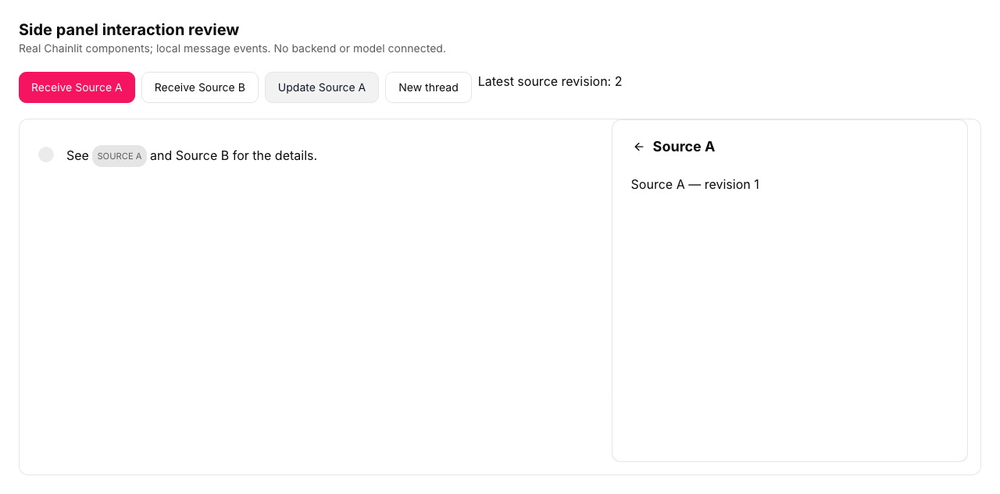

# Independent review of Chainlit #2982

The original explicit-opening change belongs to **axelray-dev** in [PR #2982](https://github.com/Chainlit/chainlit/pull/2982). This contributor branch adds a focused regression test, a supplemental fix, and a local browser review harness. It is not a duplicate upstream PR.

Reviewed original head: `645bd8e294b9909100d62d8084ac91d80a6192e9`.

## Finding and supplemental change

Opening a side element explicitly works, and later elements no longer reopen a manually closed panel. However, once opened, the panel holds the selected element object in `sideViewState`. Updating that element in the incoming `elements` array leaves the preview displaying its old URL/content.

Reproduction: receive Source A, click its reference, then update Source A. The original head shows **latest revision 2** beside a preview still displaying **revision 1**.

| Before                                                                  | After                                                               | Why                                                                |
| ----------------------------------------------------------------------- | ------------------------------------------------------------------- | ------------------------------------------------------------------ |
| An open preview holds stale selected data                               | Refresh selected elements by their stable IDs                       | The reader sees the current content                                |
| Restoring the old auto-open effect would reopen a dismissed panel       | A closed view stays closed during updates                           | Preserve the user's explicit close                                 |
| Selecting the newest incoming element would replace the reader's choice | Unrelated incoming elements do not replace the selection            | Preserve reading context                                           |
| A renamed selected element leaves its default heading stale             | Refresh a matching default heading; preserve custom titles and keys | Keep content and heading consistent without resetting custom state |

The [combined patch](selected-preview.patch) includes the production change and the complete new test file relative to the original PR head. The branch has separate diagnostic and fix commits; the patch is convenient if the author wants the final result without the intermediate expected-failure test.




## Verification

- Nine relevant tests pass: seven new interaction cases plus the original PR's two cases. Restoring the original production file makes the three refresh/title regression cases fail while the other six pass. [Original-head result](evidence/original-head-tests.log), [patched result](evidence/patched-tests.log).
- The react-client build, full frontend TypeScript check, review-harness TypeScript check, and scoped ESLint/Prettier checks passed. The production commit also passed the repository's pre-commit checks.
- Chromium with real `MessagesContainer`, message rendering, element references, Recoil state, and element views: explicit open, manual close followed by incoming updates, reopening current content, selected-content refresh, and empty-thread cleanup.
- The actual mobile Sheet at 390 × 844 and Copilot Dialog were rendered. Escape dismisses the Copilot dialog. This harness renders its actual component in a normal document, not the complete widget inside a host application's shadow root.
- The patch adds no new visual styles. The harness uses existing Chainlit components and theme tokens. [Mobile](evidence/mobile.png), [embedded component](evidence/embedded.png).

Separate accessibility observation: in this isolated harness, Escape from the unmodified Copilot Dialog leaves focus on `body`; the desktop close icon also has no accessible name. Those existing view components are outside this state-refresh patch. This is not a complete accessibility approval.

The harness injects local message/element state and serves text from `data:` URLs. No Python backend, WebSocket transport, model, production thread-resume flow, native screen reader, or full shadow-root integration was tested. The original behavior for a selected element removed while other side elements remain is not changed by this patch.

## Run

Use Node 24 and the repository's pnpm 9.15.9. From the repository root:

```sh
pnpm install --frozen-lockfile
pnpm --filter @chainlit/react-client build
pnpm --filter @chainlit/app exec vitest run MessagesContainer --threads=false
pnpm --filter @chainlit/app type-check
pnpm --filter @chainlit/app exec tsc --noEmit -p review/tsconfig.json
pnpm --filter @chainlit/app dev --host 127.0.0.1 --port 5174 --strictPort
```

Open `http://127.0.0.1:5174/side-view-review.html`. Add `?embedded` for the Copilot dialog, or use a viewport narrower than 768 px for the mobile Sheet. Start each scenario from a fresh page. Buttons produce local input state; the New thread button clears messages/elements and lets the production effect clear the preview.
